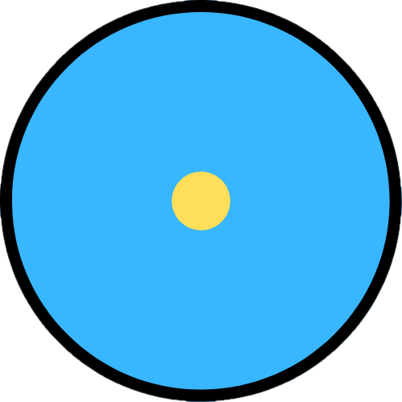
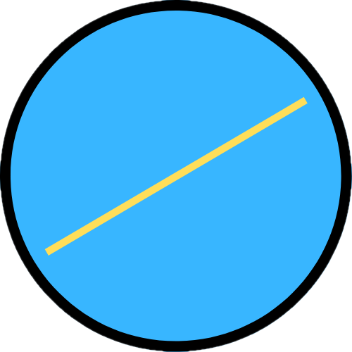
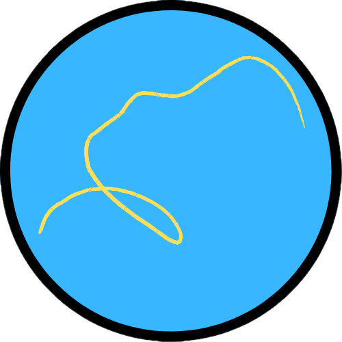
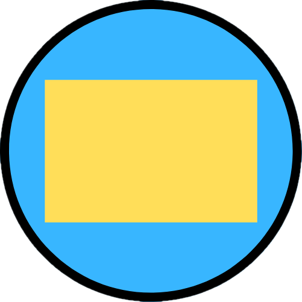
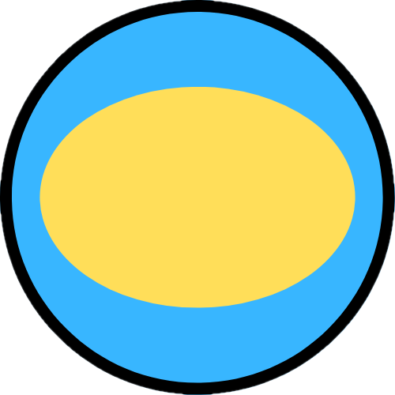
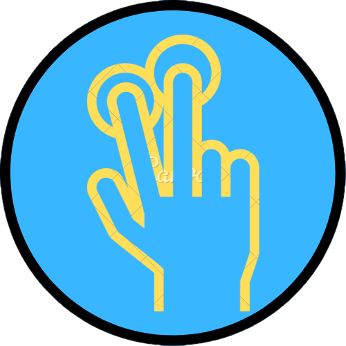
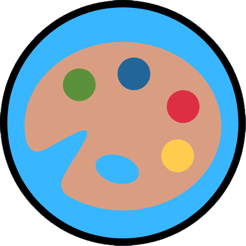
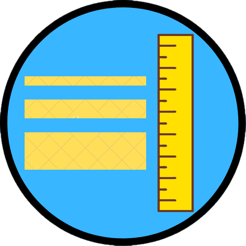
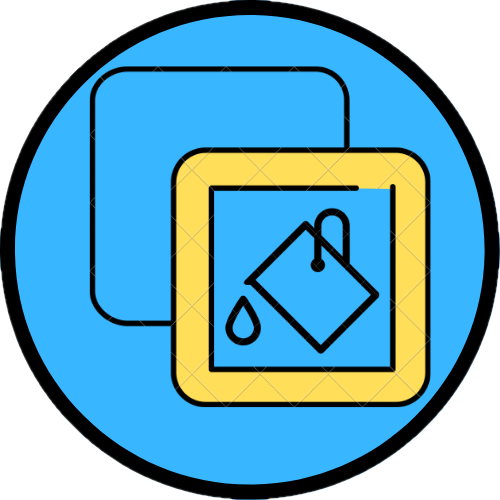
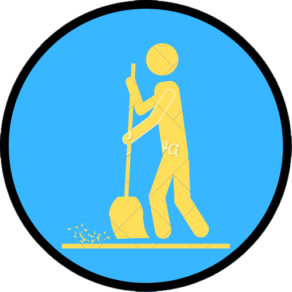

# Drawing

### [Drawing]

Программа, предоставляющая простейшие инструменты для рисования.

### [ФУНКЦИИ]

Возможности:

1. Выбор фигур из имеющегося списка (точка, линия, кривая линия, прямоугольник, овал, многоугольник);
2. выбор параметров фигуры для отображения (цвет, наличие контура и/или сплошной заливки, ширина контура);
3. рисования многоугольников в режиме 'multi-touch";
4. очиста экрана.

### [ТЕХНИЧЕСКАЯ ЧАСТЬ]

Использование:

- наследование фигур от абстрактного базового класса "Shape";
- обработка касания экрана одним и несколькими пальцами;
- рисование с применением Canvas;
- элемент выбора цвета "Pikolo" (https://github.com/Madrapps/Pikolo).

### [ИНТЕРФЕЙС]

 
- использование фигуры "Точка"; 

 
- использование фигуры "Линия"; 

 
- использование фигуры "Кривая линия"; 

 
- использование фигуры "Прямоугольник"; 

 
- использование фигуры "Овал"; 

 
- включение/отключение режима "multi-touch" для использования фигуры "Многоугольник" ; 

 
- выбор цвета; 

 
- выбор ширины контура; 

 
- выбор стиля отображения фигуры (заливка цветом и/или отрисовка контура); 

 
- очистка экрана. 

### [ПРИМЕР РАБОТЫ ПРОГРАММЫ]

1. Рисование фигур в режиме обработки касаний экрана одним пальцем.

2. Рисование фигур в режиме обработки касаний экрана несколькими пальцами.

3. Экран выбора цвета.

